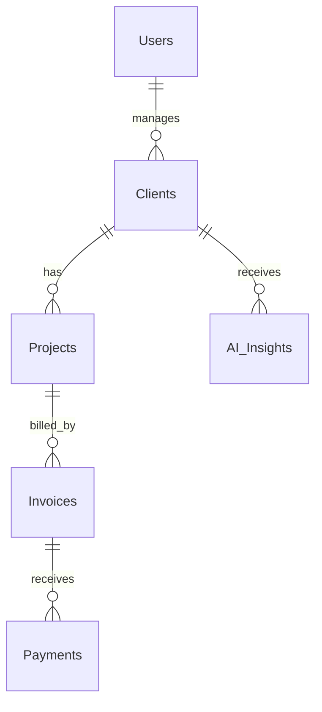

# ClientFlow

[](https://react.dev/)
[](https://nodejs.org/)
[](https://www.mysql.com/)
[](https://jwt.io/)

**ClientFlow** is an AI-powered business management platform designed specifically for freelancers and small creative professionals. It acts as a centralized assistant that streamlines daily business tasks—managing clients, tracking project milestones, generating invoices, and recording payments—while utilizing rule-based logic to analyze historical data and provide actionable recommendations to optimize business decisions.

---

## Description

ClientFlow is a comprehensive full-stack web application tailored for the unique workflows of independent professionals. Instead of forcing freelancers to jump between disconnected tools for billing, project tracking, and client communications, ClientFlow merges these functions into a single interface. 

The core power of ClientFlow lies in its built-in business assistant: a rule-based AI insight generator. Rather than relying on heavy machine learning models, the application analyzes existing client data, revision histories, and invoice timelines directly within the backend business logic. This helps freelancers identify payment risks, recognize their most valuable accounts, and implement smarter billing rules.

---

## Problem Statement

Freelancers and small creative teams face distinct structural challenges that impact their profitability and time:
1. **Administrative Fragmentation**: Tracking emails, invoices, payment statuses, and project deadlines across separate applications leads to missed payments and delays.
2. **Lack of Financial Insights**: Freelancers often struggle to quantify which clients are highly profitable versus those who require disproportionate time and effort due to excessive revision requests or payment delays.
3. **Passive Billing Strategy**: Most freelancers lack data-driven backing to confidently demand advance payments or increase revision rates, resulting in lost revenue and "scope creep."

---

## Solution

ClientFlow addresses these pain points by offering:
- **Unified CRM & PM Tools**: Seamless integration of contact information, project scope, budgets, and deadline schedules.
- **Integrated Invoicing & Payments**: Invoices map directly to active projects, allowing automatic calculations of remaining balances and payment status.
- **Rule-Based Recommendations**: Automatic backend evaluation of client performance parameters to flag high-risk accounts, highlight profitable relationships, and prompt freelancers to adjust their pricing policies.

---

## Objectives

- **Improve Client Relationship Management**: Consolidate client contact detail tracking and customized project notes.
- **Streamline Billing Workflows**: Generate professional invoices and record partial/full payments with automatic remaining-balance tracking.
- **Deliver Business Intelligence**: Provide simple, high-value alerts based on real business metrics to guide pricing strategies and negotiations.
- **Maximize User Experience**: Offer a highly responsive, modern dashboard interface featuring vital financial stats and upcoming deadlines.

---

## Features

- **Secure User Access**: Fully authenticated registration and JWT-based session security.
- **Client Profiles**: Full CRUD capabilities for managing contact cards, notes, and general client information.
- **Project Tracking**: Budget tracking, due dates, and status logging tied to specific clients.
- **Integrated Billing**: Invoice generation matched to project records, with real-time payment loggers.
- **Visual Analytics**: Interactive dashboard with revenue summaries, calendar views, and performance widgets.
- **Smart Recommendations**: Automatic rule-based notifications analyzing client behavior to suggest advance payments or rate increases.

---

## Project Modules

The application consists of six core modules:

### 1. Authentication
- **User Registration**: Clean onboarding form for new freelancers to create an account.
- **User Login**: Secure authentication flow validating credentials against hashed databases.
- **JWT Authentication**: Stateless session tokens generated for secure client-server communication.

### 2. Client Management
- **Add Client**: Create a new client profile with core contact coordinates.
- **Edit Client**: Update communication info, company names, or emails.
- **Delete Client**: Safe deletion of client profiles.
- **Client Details**: Centralized detailed screen for individual client summaries.
- **Contact Information**: Stores emails, phone numbers, and physical addresses.
- **Notes**: Custom persistent text area to record special client requirements or preferences.

### 3. Project Management
- **Create Project**: Register new projects under selected clients.
- **Assign Client**: Associate every project with a specific client record.
- **Budget**: Assign project budgets for financial tracking.
- **Due Date**: Define and track target completion deadlines.
- **Status**: Monitor lifecycle progress (e.g., Planning, In Progress, Completed, On Hold).

### 4. Invoice & Payment Management
*Combines invoicing and payments into a unified ledger.*
- **Generate Invoice**: Issue detailed digital invoices for projects.
- **Record Payment**: Log manual payments against invoices.
- **Payment Status**: Automatic status updates (e.g., Paid, Unpaid, Partially Paid, Overdue).
- **Remaining Balance**: Live calculation of outstanding amounts on active invoices.

### 5. Dashboard
*The central workspace displaying high-level metrics.*
- **Total Clients**: Quick statistic showing total clients managed.
- **Active Projects**: Live count of projects currently in progress.
- **Pending Payments**: Aggregate dollar value of outstanding invoices.
- **Revenue Summary**: Total earnings calculated from completed payments.
- **Upcoming Deadlines**: High-priority list of imminent project dates.
- **Calendar Widget**: Interactive component showing deadlines, invoice due dates, and client milestones.

### 6. AI Insights
*The unique recommendation engine built using Node.js logic.*
- **High Risk Client**: Automatically flags clients with multiple outstanding invoices.
- **Late Payment Warning**: Alerts if the client regularly pays invoices late.
- **Most Profitable Client**: Recognizes and highlights the client contributing the largest revenue share.
- **Recommend Advance Payment**: Urges requesting a deposit from historically late-paying clients.
- **Recommend Increasing Revision Charges**: Prompts the user to charge for revisions when client iterations exceed limits.

---

## Technology Stack

| Layer | Technology | Purpose |
|---|---|---|
| **Frontend** | React.js | Dynamic component-based User Interface |
| | Vite | Fast frontend build tool and dev server |
| | Material UI (MUI) | Premium design system and component framework |
| | Axios | HTTP client for backend REST communication |
| **Backend** | Node.js | Scalable runtime environment |
| | Express.js | Lightweight web framework for RESTful APIs |
| **Database** | MySQL | Robust relational database system |
| | Prisma ORM | Modern type-safe database access and migrations |
| **Authentication** | JWT | Secure stateless authorization tokens |
| | bcrypt | High-security hashing for user passwords |
| **AI Engine** | Node.js | Rule-based business logic processor |
| **Version Control** | Git & GitHub | Code hosting and collaborative version tracking |

---

## Folder Structure

```
clientflow/
├── client/                              # Frontend React Application (Vite)
│   ├── public/                          # Static assets (favicons, icons)
│   └── src/
│       ├── assets/                      # Application wide images & logos
│       ├── components/                  # Reusable UI widgets (cards, buttons, widgets)
│       ├── pages/                       # Screen views (Dashboard, Projects, Clients, Invoices)
│       ├── layouts/                     # Common page wrappers (Sidebar, Header, AuthLayout)
│       ├── routes/                      # Route definitions and route guards
│       ├── services/                    # Axios API call modules
│       ├── context/                     # Global State Providers (Auth context, Theme context)
│       ├── hooks/                       # Custom React hooks (useAuth, useFetch)
│       ├── utils/                       # Helper functions (currency and date formatters)
│       ├── styles/                      # Global CSS stylesheets
│       ├── App.jsx                      # Main routing component
│       └── main.jsx                     # Vite entry point
│
└── server/                              # Backend Node.js / Express Application
    ├── prisma/
    │   └── schema.prisma                # Prisma DB Schema and connection settings
    └── src/
        ├── config/                      # Environment variables, DB connections, CORS
        ├── controllers/                 # Express route handlers (Auth, Client, Project, Invoice)
        ├── middleware/                  # JWT validations, error handlers, request loggers
        ├── routes/                      # API endpoint definitions
        ├── services/                    # Business logic (Invoice calculations, PDF generators)
        ├── models/                      # Custom schema validations and types
        ├── utils/                       # Common utilities (logger, helpers)
        ├── validations/                 # Joi or custom request body validation schemas
        ├── ai/                          # Rule-based business recommendation engine logic
        ├── app.js                       # Express app configuration
        └── server.js                    # Server listener entry point
```

---

## Database Overview

The relational structure of ClientFlow utilizes MySQL, managed through Prisma ORM schemas. Below are the key models representing the system:



### Table Definitions

1. **Users**: System access details for freelancers.
2. **Clients**: Contact records belonging to a particular user.
3. **Projects**: Job contracts containing timeline guidelines and budgeting parameters.
4. **Invoices**: Bills representing payment milestones.
5. **Payments**: Records of partial/full payments applied to an invoice.
6. **AI_Insights**: Automated recommendation notifications generated by client analysis.

---

## Authentication Flow

ClientFlow uses JSON Web Tokens (JWT) for secure and stateless endpoint access:

```
[Client App]                        [Backend Express API]
     |                                        |
     | ----- 1. POST /api/auth/login -------> |
     |                                        | -- 2. Validate user & verify password with bcrypt
     |                                        | -- 3. Generate signed JWT (User payload)
     | <---- 4. Send token in JSON response - |
     |                                        |
     | (Stores token in localStorage/cookie)   |
     |                                        |
     | ----- 5. Header: Bearer <Token> -----> |
     |          Protected Endpoint Request    | -- 6. Check Token inside Authorization Middleware
     |                                        | -- 7. Process Request and return secured resource
     | <---- 8. Return JSON Response -------- |
```

---

## API Overview

| Method | Endpoint | Description | Protected |
|---|---|---|---|
| **POST** | `/api/auth/register` | Create a new freelancer account | No |
| **POST** | `/api/auth/login` | Authenticate credentials and return JWT | No |
| **GET** | `/api/clients` | Retrieve all clients for the logged-in user | Yes |
| **POST** | `/api/clients` | Add a new client record | Yes |
| **PUT** | `/api/clients/:id` | Update client profile details | Yes |
| **DELETE** | `/api/clients/:id` | Delete a client profile | Yes |
| **GET** | `/api/projects` | Fetch all projects | Yes |
| **POST** | `/api/projects` | Initialize a project | Yes |
| **POST** | `/api/invoices` | Create a project invoice | Yes |
| **POST** | `/api/invoices/:id/payments` | Record a payment received against an invoice | Yes |
| **GET** | `/api/insights` | Retrieve current recommendation items | Yes |

---

## AI Recommendation Engine

The recommendation module leverages rule-based business logic processed inside the Node.js backend. Instead of complex predictive modeling, it evaluates real transaction indicators to prompt optimization:

### Evaluation Rules

*   **Advance Payment Prompt**
    $$\text{Average Payment Delay} > 15 \text{ days} \implies \text{Recommend 50\% Advance Payment}$$
    *Logic: If a client consistently delays payments past due dates by more than 15 days, future project scopes automatically show an insight proposing advance deposit requirements.*
*   **Revision Charge Warning**
    $$\text{Project Revisions} > 5 \implies \text{Recommend Increasing Revision Charges}$$
    *Logic: When active projects show a high count of revisions, the system advises the freelancer to adjust pricing structures to charge for supplementary iterations.*
*   **Most Profitable Client**
    $$\text{Client Total Paid Revenue} = \max(\text{All Clients}) \implies \text{Mark as Most Profitable Client}$$
    *Logic: Scans absolute transaction data, applying a special premium badge to the client profile generating the highest aggregate income.*
*   **High Risk Client**
    $$\text{Unpaid Invoices Count} > 1 \implies \text{Mark Client as High Risk}$$
    *Logic: Flags any client who has more than one invoice in the "Unpaid" or "Overdue" status, cautioning against commencing new projects with them.*

---

## Installation Guide

Ensure you have [Node.js](https://nodejs.org/) (v16+) and [MySQL](https://www.mysql.com/) installed before beginning.

### 1. Frontend Setup
```bash
# Navigate to client directory
cd client

# Install packages
npm install
```

### 2. Backend Setup
```bash
# Navigate to server directory
cd server

# Install packages
npm install

# Generate Prisma Client
npx prisma generate

# Apply migrations to local MySQL instance
npx prisma migrate dev
```

---

## Running the Project

### Start Frontend Server
From the `client/` directory:
```bash
npm run dev
```
The React development server launches at `http://localhost:5173`.

### Start Backend API Server
From the `server/` directory:
```bash
npm run dev
```
The Express API engine starts listening at `http://localhost:5000`.

---

## Future Enhancements

- **Automated Billing Alerts**: Schedule automated email reminders for unpaid invoices.
- **Payment Gateway Integrations**: Direct Stripe, PayPal, or Wise link processors for instant customer checkout.
- **Multi-Currency Processing**: Seamlessly toggle exchange rates for international clients.
- **Expense Tracking & Tax Estimation**: Automated local taxation brackets and general business expenditure records.

---

## Contributing

1. **Fork** the project repository.
2. **Create** your feature branch (`git checkout -b feature/NewFeature`).
3. **Commit** your updates (`git commit -m 'feat: add some new feature'`).
4. **Push** to the origin branch (`git push origin feature/NewFeature`).
5. **Open** a Pull Request against the main branch.

---

## License

Distributed under the MIT License. See `LICENSE` for more information.
